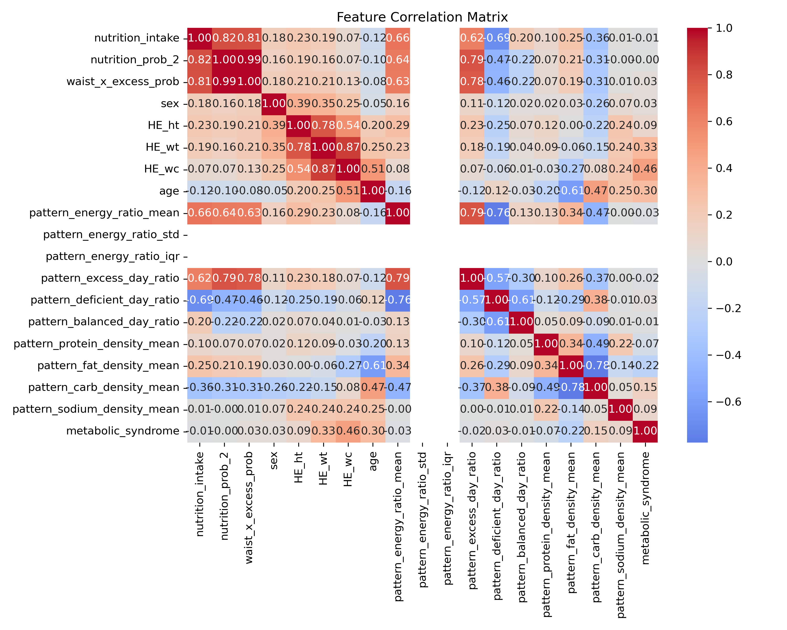
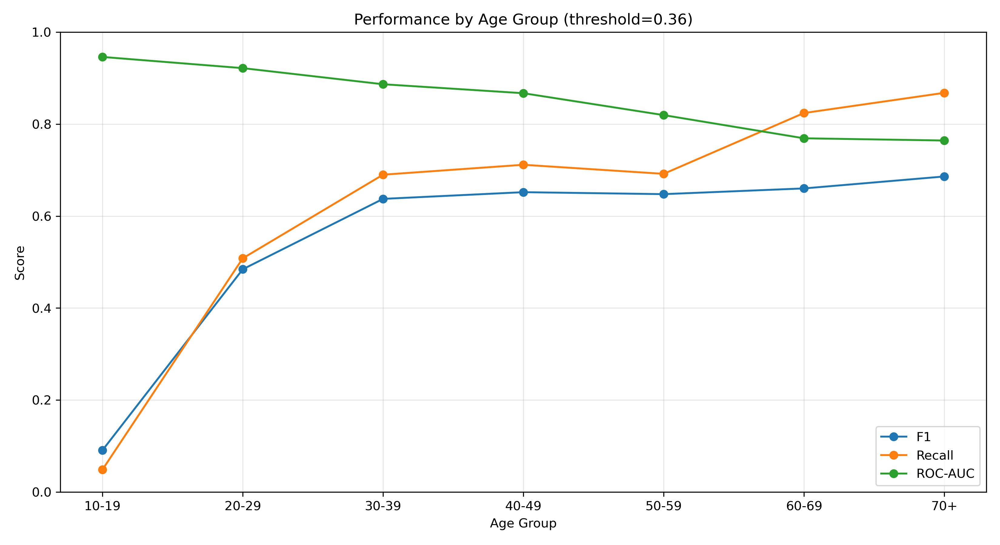

# 비침습 입력 기반 대사증후군 위험 분류: 생활패턴 스무딩 피처와 임계값 최적화 기반 XGBoost 연구

## 국문초록
본 연구는 혈액검사 없이 수집 가능한 비침습 입력(연령, 성별, 키, 체중, 허리둘레, 영양섭취 상태)으로 대사증후군 위험을 분류하는 머신러닝 파이프라인을 제안한다. 데이터셋 간 직접 병합이 어려운 상황(`NHANES_2017_2023.csv`, `nutrient_2019.csv`)을 해결하기 위해 영양 라벨 전이(label transfer) 전략을 적용했다. 특히 개인의 일일 섭취 분포를 이용한 생활패턴 스무딩 피처(변동성, 과잉/부족일 비율, 영양밀도)를 설계해 모델에 반영했다. 타깃 라벨은 한국형 허리둘레 기준(남 90cm, 여 80cm)을 포함한 대사증후군 기준으로 구성했다. 결측치는 KNNImputer로 보정하고, XGBoost는 GridSearchCV(ROC-AUC 기준)로 최적화했다. 실험 결과 Full 모델(스무딩 피처 전체 포함)이 Light 모델 대비 F1과 AUC에서 근소하게 우수했으며, 최종 운영 모델은 Full+F1 최적 임계값(0.36)으로 선정했다. 기본 임계값(0.50)에서 Accuracy 0.8109, F1 0.5404, ROC-AUC 0.8664, F1 최적 임계값에서 F1 0.6530, Recall 0.7571을 기록했다.

주요어: 대사증후군, 비침습 분류, 생활패턴 스무딩, 라벨 전이, XGBoost, 임계값 최적화

## 1. Introduction
대사증후군은 심혈관계 질환 및 당뇨병 위험과 밀접하게 연관되며 조기 선별이 중요하다 [1][2]. 그러나 실제 사용자 환경에서는 혈액검사 기반 정밀 진단 이전에, 비침습 정보 기반 위험 선별이 먼저 수행될 필요가 있다. 본 연구는 캡스톤 프로젝트 맥락에서 실서비스 연계를 고려한 선별형 모델을 구축하고, 생활패턴 스무딩 피처가 분류 성능에 미치는 영향을 분석한다.

## 2. Methods

### 2.1 Data and Pipeline
- 건강 데이터: `data/raw/NHANES_2017_2023.csv`
- 영양 데이터: `data/raw/nutrient_2019.csv`

파이프라인은 다음 순서로 구성된다.
1. 영양 데이터 개인화 라벨 생성
2. NHANES 대상 영양 라벨 전이
3. 대사증후군 타깃 라벨링
4. XGBoost 학습 및 임계값 최적화
5. A/B 모델 비교

### 2.2 생활패턴 스무딩 기법
`nutrient_2019`는 동일 ID 내 다중 식사행을 포함하므로 다음 스무딩 절차를 적용했다.
1. `ID + N_DAY(+year)` 단위로 하루 섭취량 합산
2. 개인 단위 분포 통계 추출: 평균, 표준편차, IQR
3. 과잉/부족/균형 일수 비율 산출
4. 열량당 영양밀도(단백질/지방/탄수/나트륨) 계산
5. KNN 이웃 가중평균으로 NHANES 대상에 스무딩 피처 전이

사용된 스무딩 피처:
- `pattern_energy_ratio_mean`
- `pattern_energy_ratio_std`
- `pattern_energy_ratio_iqr`
- `pattern_excess_day_ratio`
- `pattern_deficient_day_ratio`
- `pattern_balanced_day_ratio`
- `pattern_protein_density_mean`
- `pattern_fat_density_mean`
- `pattern_carb_density_mean`
- `pattern_sodium_density_mean`

### 2.3 Label Definition
대사증후군 라벨은 5개 기준 중 3개 이상 충족 시 1로 정의했다.
- 복부비만: 남 >= 90cm, 여 >= 80cm
- TG >= 150
- HDL 저하: 남 < 40, 여 < 50
- 혈압: SBP >= 130 또는 DBP >= 85
- 공복혈당 >= 100

### 2.4 Model and Evaluation
- 모델: XGBoost [5]
- 결측치: KNNImputer [6]
- 탐색: GridSearchCV(5-fold, scoring=ROC-AUC) [4]
- best params: `colsample_bytree=0.8`, `learning_rate=0.01`, `max_depth=5`, `n_estimators=200`, `subsample=0.8`

임계값은 0.10~0.90을 0.01 간격으로 탐색했다.
- F1 최적 임계값
- Recall 우선 임계값(precision >= 0.50 조건)

## 3. Results

### 3.1 Full 모델 성능
- Default threshold(0.50):  
  Accuracy 0.8109, Precision 0.6319, Recall 0.4720, F1 0.5404, ROC-AUC 0.8664
- F1 최적 threshold(0.36):  
  Accuracy 0.8105, Precision 0.5740, Recall 0.7571, F1 0.6530
- Recall 우선 threshold(0.23):  
  Precision 0.5052, Recall 0.8603, F1 0.6366

### 3.2 A/B 비교
| Model | Features | Default F1 | ROC-AUC | Best-F1 Threshold | Best-F1 |
|---|---:|---:|---:|---:|---:|
| Full | 18 | 0.5404 | 0.8664 | 0.36 | 0.6530 |
| Light | 11 | 0.5364 | 0.8662 | 0.34 | 0.6517 |

최종 선정: **Full + F1 최적 threshold(0.36)**  
선정 근거: A/B 비교에서 Full이 F1, AUC 모두 근소 우세.

### 3.3 연령대별 성능 편차
연령대별 분석에서 고연령군으로 갈수록 Recall/F1은 상승하는 경향을 보였으며, ROC-AUC는 낮아지는 경향이 관찰되었다. 이는 연령군별 위험도 분포 차이와 threshold 운영 전략의 중요성을 시사한다.

## 4. Discussion
본 연구는 직접 병합 불가 데이터 환경에서 라벨 전이 + 생활패턴 스무딩 전략으로 분류 성능을 안정화했다. 특히 threshold 최적화는 불균형 분류에서 선별 성능 향상에 효과적이었다. 다만 현재 데이터의 `recorded_days` 분포가 짧아(중앙값 1일) “월단위 패턴”을 완전하게 반영하기에는 제한이 있다.

## 5. Conclusion
비침습 입력 기반 대사증후군 선별에서 생활패턴 스무딩 피처는 성능 개선에 기여했으며, Full 모델이 경량 모델 대비 소폭 우수했다. 운영 기준으로는 Full 모델의 F1 최적 threshold를 채택하고, 선별 강화 시나리오에서는 Recall 우선 threshold를 보조 정책으로 병행할 수 있다.

## Figures
### Figure 1. Feature Correlation Heatmap

### Figure 2. Performance by Age Group

## References
[1] Expert Panel on Detection, Evaluation, and Treatment of High Blood Cholesterol in Adults. Executive summary of the third report of the National Cholesterol Education Program (NCEP) Adult Treatment Panel III. JAMA. 2001;285(19):2486-2497.  
[2] Alberti KGMM, Eckel RH, Grundy SM, et al. Harmonizing the metabolic syndrome. Circulation. 2009;120(16):1640-1645.  
[3] Ministry of Health and Welfare (Korea), Korea Disease Control and Prevention Agency. Korea National Health and Nutrition Examination Survey (KNHANES) documentation.  
[4] Pedregosa F, Varoquaux G, Gramfort A, et al. Scikit-learn: Machine Learning in Python. JMLR. 2011;12:2825-2830.  
[5] Chen T, Guestrin C. XGBoost: A scalable tree boosting system. KDD 2016:785-794.  
[6] Troyanskaya O, Cantor M, Sherlock G, et al. Missing value estimation methods for DNA microarrays. Bioinformatics. 2001;17(6):520-525.

## Ethical Statement
본 모델은 연구/건강관리 참고용이며 의료 진단·치료·처방을 대체하지 않는다.

